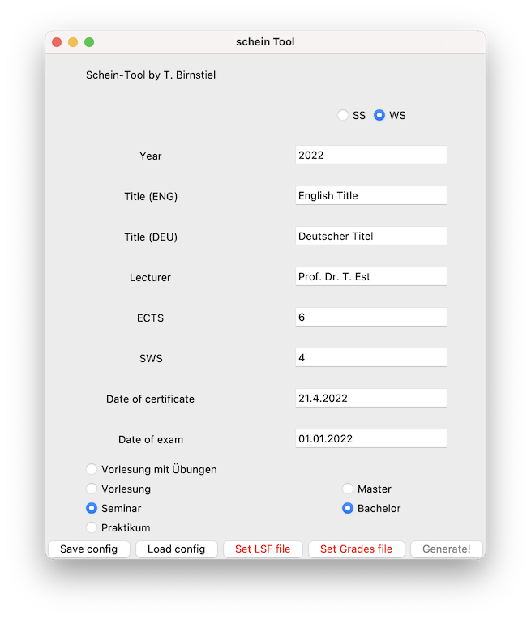

# LMU Scheintool

Tool to generate **LMU Physics certificates** based on LSF data and a CSV/Excel file of Matrikelnumbers and grades. An Excel file for the examination office is created as well.

## Installation

On a system with a python version above 3.9 you can just clone this repository and run the `Scheintool.py` script. If you install the package using `pip install .` in the base of the repository, then the command `schein` is added to your command line.

## Building

To save size of the final file, create an environment with

    conda env create -f environment.yml

then activate it with

    conda activate scheintool-env

then go into the `scheintool` sub-folder where the `Makefile` is located and call `make`. On Windows, execute the command in the make file, but replace the `:` with `;`. The resulting apps should be build in the `dist/` folder.

## Setup Libreoffice

The `.XLS` file created by the LSF is not in a format that can be read by python directly (otherwise, let me know!). Therefore, it needs to be converted to a modern `.xlsx` format. `Scheintool` uses *Libreoffice* for that. To this end, it will search the default location of the executable `soffice`. If it is found, it will be stored as a config file `scheintool.yml`, otherwise it will ask for the path.

Alternatively, you could first open the `.XLS` file with Microsoft Excel and save it as a `.xslx` file - this can be processed directly without the need to use *Libreoffice*.

## Usage

To generate a PDF with the certificates, 3 things are needed:

- *General lecture information*: these can be entered in the interface of Scheintool directly. The settings can also be stored and loaded from there.
- *Participant information*: this comes from the LSF where a `.XLS` file can be downloaded. This is usually in an outdated format and will be converted to `.xlsx` automatically.
- *Grades*: For this you can create a `.csv` file that looks like this

        matrikelnummer,note
        12345678,1.0
        87654321,2.7

    or an excel table with the same structure. The order of the columns does not really matter and several column names are acceptable as well ('Note', 'grades', ...).

Once all the information is entered in the fields and the files are selected, you can click on the `Generate!` button, select the name under which to store the PDF and the certificates should be generated.

## Example

You can find example files in the folder [example](https://github.com/birnstiel/scheintool/tree/main/example). Either `grades.csv` or `noten.xlsx` can be used as grades file and either of the `LSF.*` files can be used as participant data file. This screenshot shows the settings stored in `config.txt`.

## Disclaimer

Use at own risk, no guarantees!
